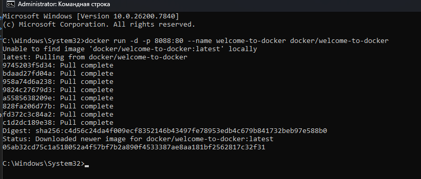

## Welcome to Docker

Репозиторий welcome-to-doker для обучения базе докера и его функций


> Перед созданием проекта убедитесь, что порт `8088` не занят другим приложением!


Открытый порт 8088


Загрузка образа и запуск контейнера
```shell
docker run -d -p 8088:80 --name welcome-to-docker docker/welcome-to-docker
```




[Открыть http://localhost:8088 в браузере](http://localhost:8088)

Скрин контейнера в браузере


Зайти в контейнер
```shell
docker exec -it welcome-to-docker /bin/sh
```


Выполнение разных команд:

Инфа об ОС + монитор ресурсов
```shell
uname -a

top
```


Обновление программ
```shell
apk update && apk upgrade
```


Установка fastfetch и запуск fastfetch
```shell
apk add fastfetch
```
```shell
fastfetch
```


Выйти из образа обратно в основную систему
```shell
exit
```


Все скриншоты в папке docker/img