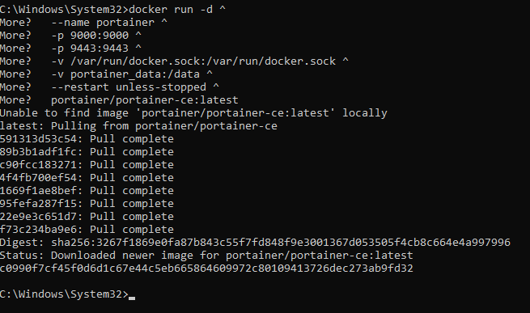
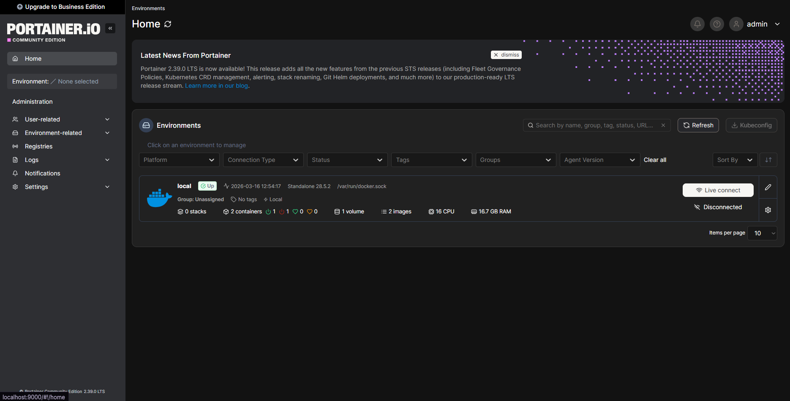
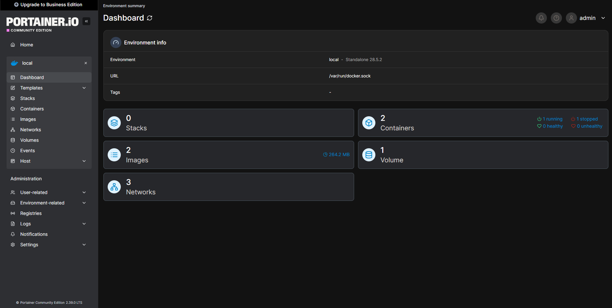
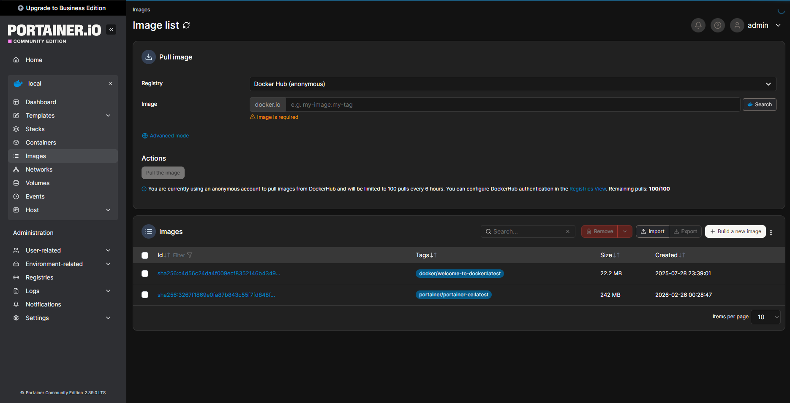
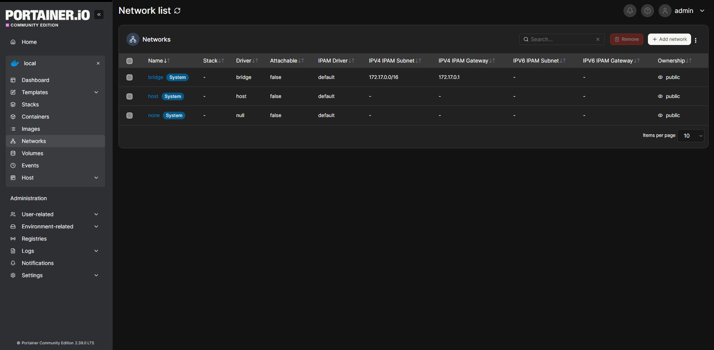
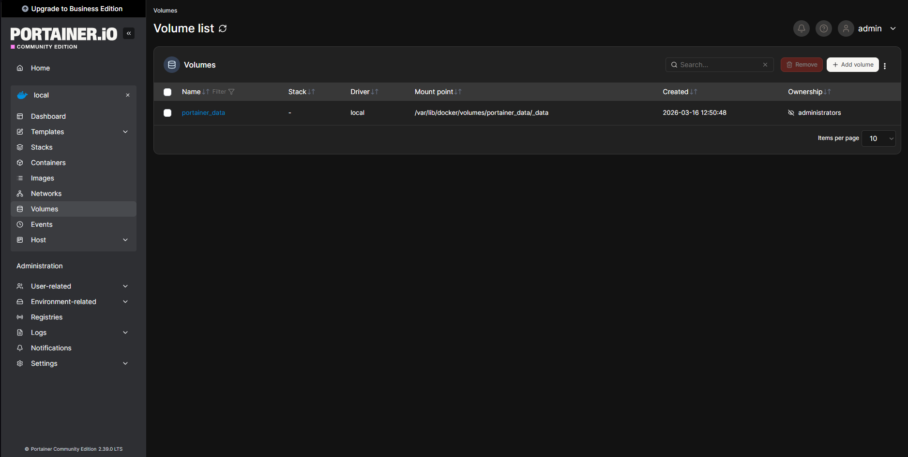
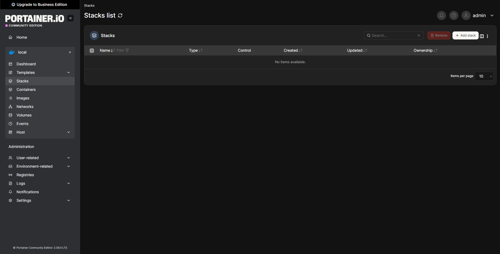

### Portainer

## Как запустить и начать использование

Чтобы начать пользоваться нужно открыть cmd и вставить комманлу ниже.
```bash
docker run -d ^
  --name portainer ^
  -p 9000:9000 ^
  -p 9443:9443 ^
  -v /var/run/docker.sock:/var/run/docker.sock ^
  -v portainer_data:/data ^
  --restart unless-stopped ^
  portainer/portainer-ce:latest
```


После чего подключиться в браузере к -> http://localhost:9000/

Создайте пароль администратора(Минимум 12 символов) и войдите в админ-панель.[Забыл скрин :( ]


## Основные возможности
# Dashboard (Главная панель):

Приветсветнная страничка

Dashboard


* Обзор всех контейнеров, образов, сетей, томов
Использование ресурсов (CPU, RAM, диски)
Быстрый доступ к логам, консоли.
* Dashboard показывает:
Количество контейнеров (работающих/остановленных)
Использование CPU и памяти
Сетевой трафик
Активность дисков
* Что можно делать с контейнерами:
* Создавать/удалять/останавливать/перезапускать
Просматривать логи в реальном времени
Открывать терминал внутри контейнера
Копировать файлы в/из контейнера
Просматривать статистику использования ресурсов
Экспортировать/импортировать контейнеры

# Образы (Images):



* Просмотр всех образов
Pull новых образов из Docker Hub
Удаление образов
Сборка образов из Dockerfile
# Сети (Networks):



* Создание пользовательских сетей
Просмотр сетевой топологии
Подключение/отключение контейнеров к сетям
# Тома (Volumes):



* Создание и удаление томов
Просмотр содержимого томов
Резервное копирование томов
# Стеки (Stacks):



* Развёртывание Docker Compose файлов
Управление несколькими сервисами
Просмотр логов и статуса стека