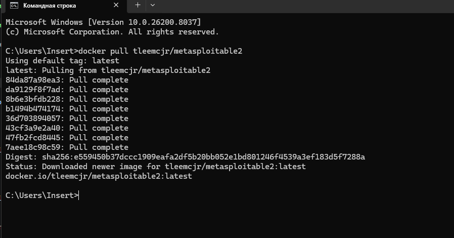
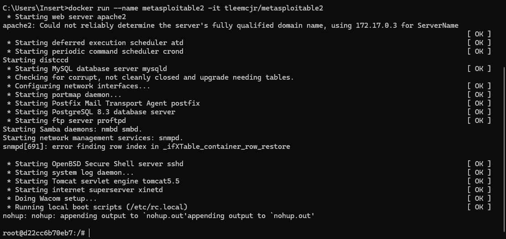
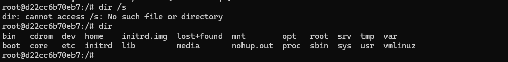
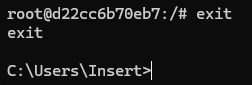
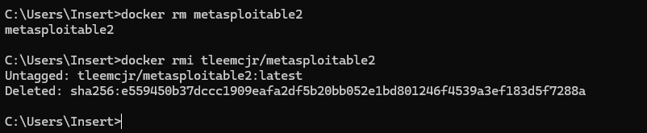

## Metasploitable2 docker

> Никогда в разработке не используйте русские имена файлов и каталогов!

> Никогда в разработке не используйте пробелы и спец.символы в именах файлов и каталогов!

Metasploitable2 — специально уязвимая виртуальная машина Linux, созданная проектом Metasploit. Предназначена для использования в качестве среды обучения и тестирования для специалистов и энтузиастов в области безопасности, чтобы практиковать навыки взлома и пентеста.

Установить докер-образ

```shell
docker pull tleemcjr/metasploitable2
```



Загрузить образ, создать и запустить контейнер, войти в него (для Windows)
```shell
docker run --name metasploitable2 -it tleemcjr/metasploitable2
```



Комнда dir
```shell
dir
```


Остановить контейнер и выйти из него
```shell
exit
```



Удалить контейнер
```shell
docker rm metasploitable2
```

Удалить образ
```shell
docker rmi tleemcjr/metasploitable2
```



[Metasploitable2 на Docker hub](https://hub.docker.com/r/tleemcjr/metasploitable2#!)

> Если вы обнаружили ошибку в этом тексте - сообщите пожалуйста автору!