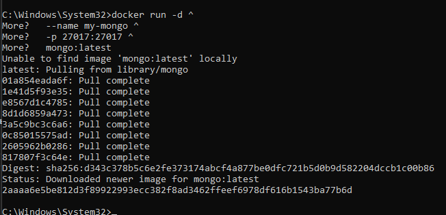
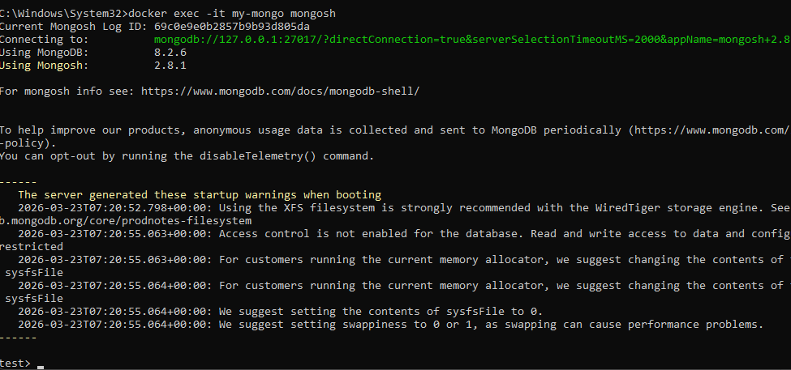
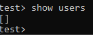
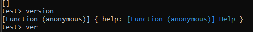

## MongoDB (NoSQL)

> Никогда в разработке не используйте русские имена файлов и каталогов!

> Никогда в разработке не используйте пробелы и спец.символы в именах файлов и каталогов!

1. Запуск **MongoDB**

в **Windows Powershell**
```shell
docker run -d ^
  --name my-mongo ^
  -p 27017:27017 ^
  mongo:latest
```


2. Подключиться через shell
```shell
docker exec -it my-mongo mongosh
```

Повыполняйте какие-нибудь команды в этой БД для проверки и пришлите скрины




> Если вы обнаружили ошибку в этом тексте - сообщите пожалуйста автору!