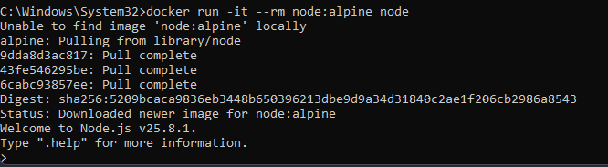
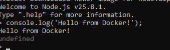
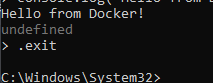

## Node.js для JavaScript

> Никогда в разработке не используйте русские имена файлов и каталогов!

> Никогда в разработке не используйте пробелы и спец.символы в именах файлов и каталогов!

Запустить Node.js REPL
```shell
docker run -it --rm node:alpine node
```

И запустить скрипт
```shell
console.log('Hello from Docker!');
```

Для выхода из консоли
```shell
.exit
```

> Если вы обнаружили ошибку в этом тексте - сообщите пожалуйста автору!