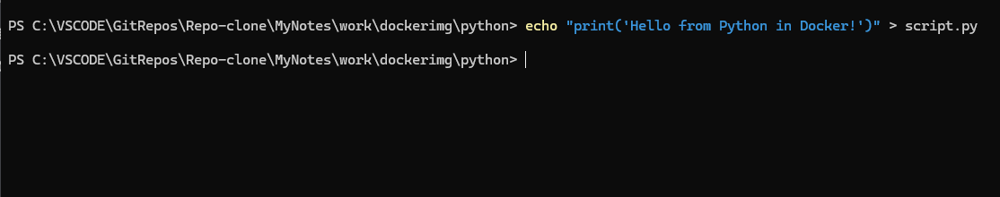
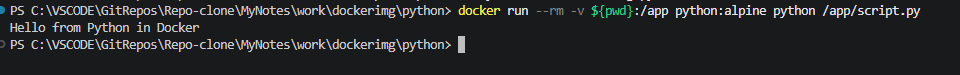
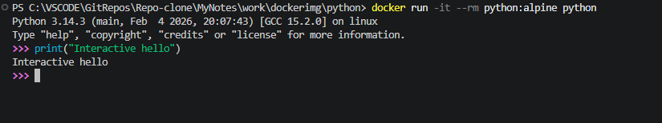

## Python для запуска скриптов

Выполните все этапы работы с проектом по примеру с [Nginx](/content/Docker/ImageLibrary/Nginx.md)

> Никогда в разработке не используйте русские имена файлов и каталогов!

> Никогда в разработке не используйте пробелы и спец.символы в именах файлов и каталогов!

1. Создайте **Python** скрипт в **Git-bash**
```shell
echo "print('Hello from Python in Docker!')" > script.py
```



2. Запустите скрипт в контейнере **Python** в **PowerChell**
```shell
docker run --rm -v ${pwd}:/app python:alpine python /app/script.py
```



3. Интерактивный **Python** (опционально)
```shell
docker run -it --rm python:alpine python
```



> Если вы обнаружили ошибку в этом тексте - сообщите пожалуйста автору!