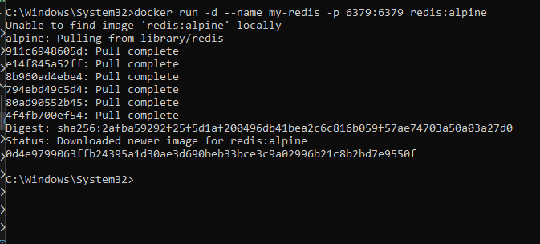
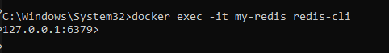
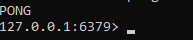
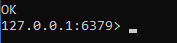
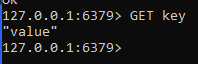

## База данных Redis

> Никогда в разработке не используйте русские имена файлов и каталогов!

> Никогда в разработке не используйте пробелы и спец.символы в именах файлов и каталогов!

1. Запуск Redis
```shell
docker run -d --name my-redis -p 6379:6379 redis:alpine
```

2. Подключиться к Redis CLI
```shell
docker exec -it my-redis redis-cli
```


Внутри Redis: ping → PONG, SET key value, GET key - ?

3. ping  
4. SET key value 
5. GET key 
> Если вы обнаружили ошибку в этом тексте - сообщите пожалуйста автору!