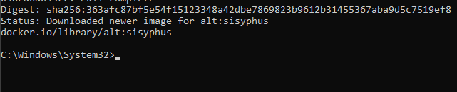
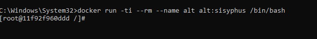
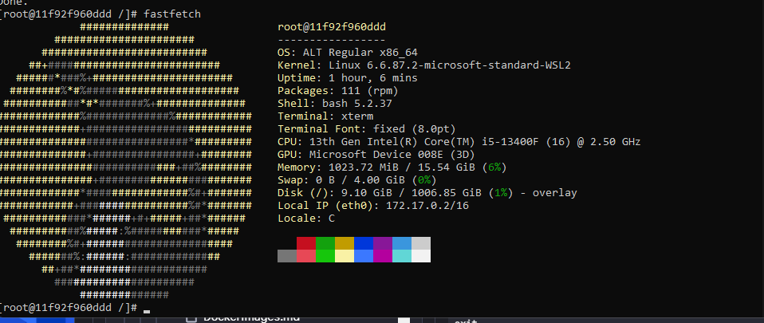
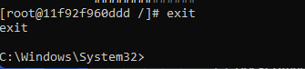

## Alt Linux в Docker

> Никогда в разработке не используйте русские имена файлов и каталогов!

> Никогда в разработке не используйте пробелы и спец.символы в именах файлов и каталогов!!

#### Использовать контейнер с Alt

##### Загрузить готовый образ Alt
```shell
docker pull alt:sisyphus
```



##### Запустить и использовать
```shell
docker run -ti --rm --name alt alt:sisyphus /bin/bash
```



#### Установить приложение Fastfetch в контейнере
```shell
apt-get update && apt-get install fastfetch
```



##### Выйти из контейнера с Alt
```shell
exit
```



### Полезные ссылки

[alt Docker Official Image](https://hub.docker.com/_/alt/)

[Dockerfile](https://github.com/alt-cloud/docker-brew-alt/blob/p10/x86_64/Dockerfile)

[Docker Alt Linux Image](https://github.com/sibsau/docker-alt/blob/master/README.md)

> Если вы обнаружили ошибку в этом тексте - сообщите пожалуйста автору!