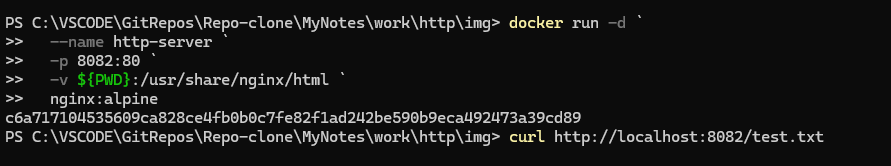
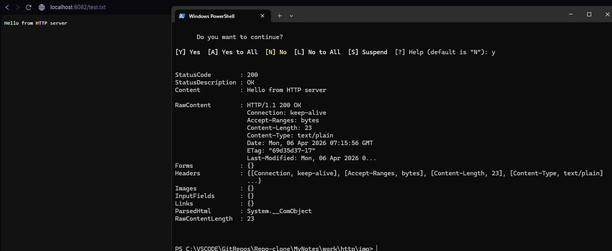

## HTTP-сервер для раздачи файлов

Выполните все этапы работы с проектом по примеру с [Nginx](/content/Docker/ImageLibrary/Nginx.md)

> Никогда в разработке не используйте русские имена файлов и каталогов!

> Никогда в разработке не используйте пробелы и спец.символы в именах файлов и каталогов!

> Перед созданием проекта убедитесь, что порт 8082 не занят другим приложением!

1. Создайте тестовый файл
echo "Hello from HTTP server" > test.txt
2. Запустите простой HTTP сервер

в **Windows Powershell**
```shell
docker run -d `
  --name http-server `
  -p 8082:80 `
  -v ${PWD}:/usr/share/nginx/html `
  nginx:alpine
```



3. Проверьте
```shell
curl http://localhost:8082/test.txt
```



> Если вы обнаружили ошибку в этом тексте - сообщите пожалуйста автору!