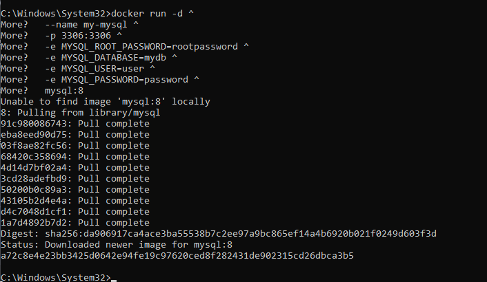
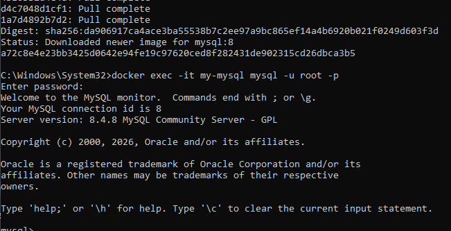
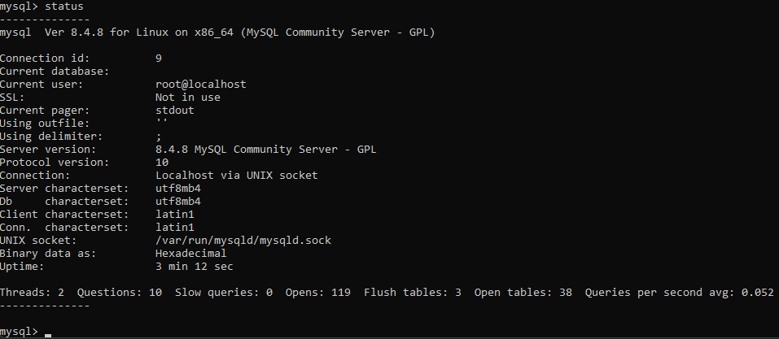
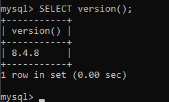
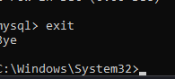

## MySQL база данных

> Никогда в разработке не используйте русские имена файлов и каталогов!

> Никогда в разработке не используйте пробелы и спец.символы в именах файлов и каталогов!

1. Запуск **MySQL**

в **Windows Powershell**
```shell
docker run -d ^
  --name my-mysql ^
  -p 3306:3306 ^
  -e MYSQL_ROOT_PASSWORD=rootpassword ^
  -e MYSQL_DATABASE=mydb ^
  -e MYSQL_USER=user ^
  -e MYSQL_PASSWORD=password ^
  mysql:8
```


2. Подключиться
```shell
docker exec -it my-mysql mysql -u root -p
```
> Пароль: rootpassword

Повыполняйте какие-нибудь команды SQL для проверки и пришлите скрины.

Получить список баз данных:
```sql
sql
```
Получить версию:
```sql
SELECT version();
```

выйти из БД
```sql
exit
```


> Если вы обнаружили ошибку в этом тексте - сообщите пожалуйста автору!