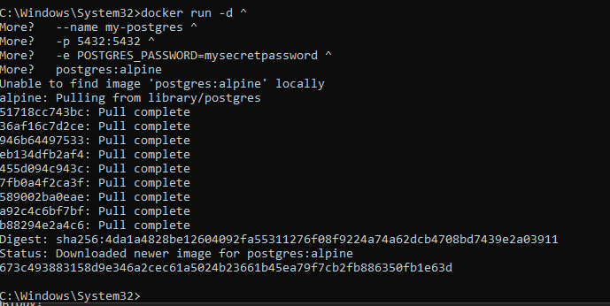
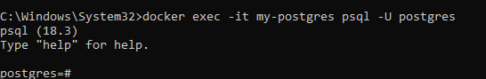
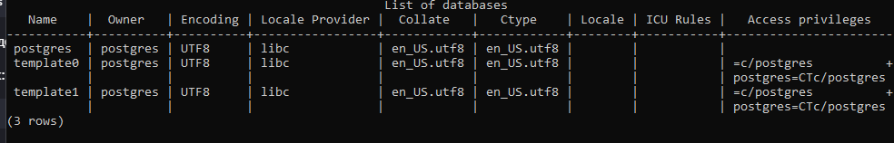
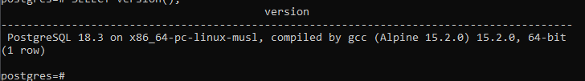
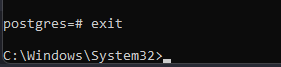

## PostgreSQL

> Никогда в разработке не используйте русские имена файлов и каталогов!

> Никогда в разработке не используйте пробелы и спец.символы в именах файлов и каталогов!

Запуск PostgreSQL с паролем

в **Windows Powershell**
```shell
docker run -d ^
  --name my-postgres ^
  -p 5432:5432 ^
  -e POSTGRES_PASSWORD=mysecretpassword ^
  postgres:alpine
```


Подключиться через psql
```shell
docker exec -it my-postgres psql -U postgres
```

- Выполнить несколько демонстрационных команд, например:

Получить список баз данных:
```sql
\l
```

Получить версию:
```sql
SELECT version();
```

выйти из БД
```sql
exit
```


> Если вы обнаружили ошибку в этом тексте - сообщите пожалуйста автору!